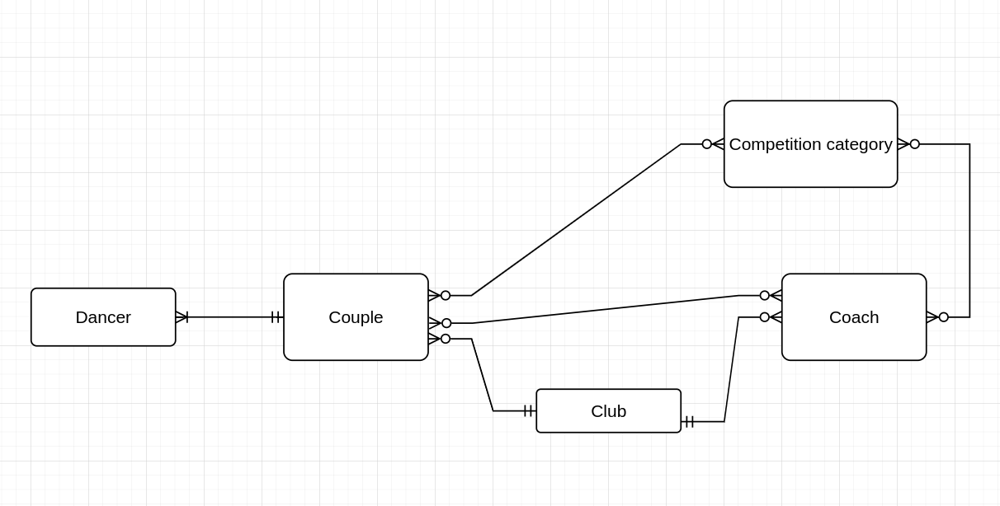
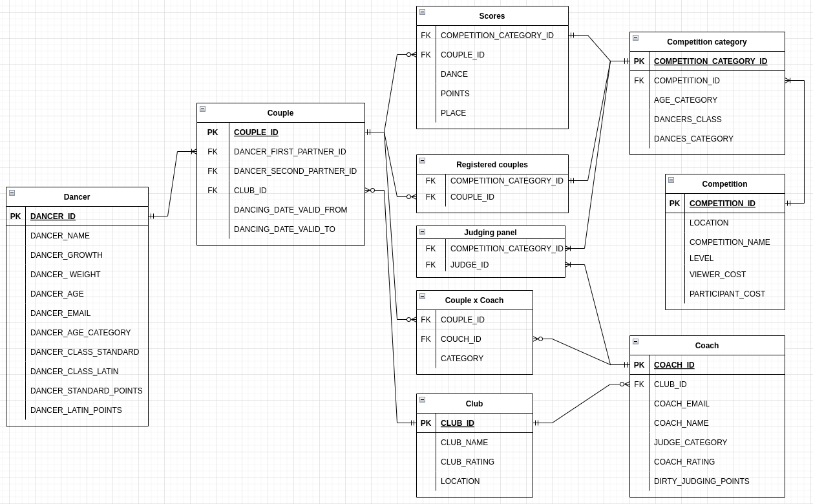
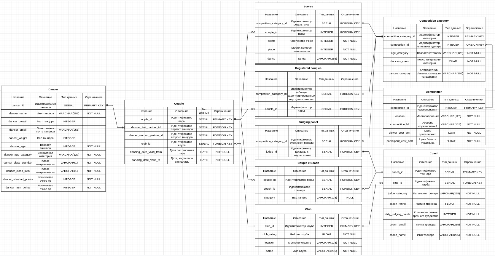

# База данных ballroom_database

## Таблицы

1) Dancer - хранит в себе информацию о танцоре, его рост, вес и информацию, связанную с бальными танцами.
2) Club - отвечает за информацию о клубах (местоположение, рейтинг, название).
3) Couple - привязана к двум танцорам одновременно, хранит информацию о паре, так же достпуна **версионность** в
   формате, актуальный ли состав пары.
4) Coach - хранит информацию о тренерах, тренера привязаны к клубам, но при этом могут тренеровать пары с других клубов.
5) Couple_x_Coach - таблица связка между тренерами и парами, кто кого тренерует, по какой программе.
6) Competition - описывает турниры, где они проходят, какая плата за вход.
7) Competition_Category - описывает категории, достпуные для пар.
8) Registered_Couples - список зарегестрированных пар, относительно категорий.
9) Scores - Информация о парах, участвоваших в категориях, их места и кол-во набранных очков по каждому танцу.
10) Judging_Panel - судейская панель, список тренеров, судящих определенную категорию.

## Модели

### Концептуальная

### Логическая

### Физическая

> Рассмотреть модели в хорошем качестве, [здесь](./docs/models.pdf).
## CRUD
> CRUD — акроним, обозначающий четыре базовые функции, используемые при работе с базами данных: создание (англ. create), чтение (read), модификация (update), удаление (delete). Введён Джеймсом Мартином в 1983 году как стандартная классификация функций по манипуляции данными.

На crud запросы можно посмотреть вот [здесь](./sql/crud.sql).

## Сложные SELECT-запросы
 1) Задача:
   Вывести количество соревнований каждого уровня,
   среднюю стоимость зрительского билета,
   средняя стоимость которого меньше 900. 
   > 
   > P.s. Use GROUP BY + HAVING
 - [Ответ](./sql/select-1.sql)
 2) Задача:
   Вывести топ-5 номера пар в категории Молодежь С класс Латина,
   в соревновании 'Весенний бал Терпсихоры', по танцy Самба (S).
   > 
   > P.s. Use ORDER BY
 - [Ответ](./sql/select-2.sql)
 3) Задача:
   Вывести сводную таблицу с названиями соревнований,
   уровнем соревнований, ценой зрительского билета
   и средней ценой зрительского билета для этого уровня соревнований.
   > 
   >P.s. Use func(...) OVER(...): PARTITION BY
 - [Ответ](./sql/select-3.sql)
 4) Задача:
   Вывести антитоп судей, по очкам грязного судейства, в формате:
   Ранг судьи, имя Фамилия, категория, кол-во очков грязного судейства.
   > 
   > P.s. Use func(...) OVER(...): ORDER BY
 - [Ответ](./sql/select-4.sql)
 5) Задача:
   Вывести топ пар, по каждому из танцев по Латине независимо от категории,
   в которой участвовала пара, в формате: место, номер категории, номер пары, танец.
   > 
   > P.s. Use func(...) OVER(...): PARTITION BY + ORDER BY
 - [Ответ](./sql/select-5.sql)
 6) Задача:
  Для Регины Абрамовой посчитать, как долго она не стояла в паре(в днях), начиная с '2020-11-02' по '2022-12-30',
  построить топ перерывов по длительности.
   > 
   > P.s. Use func(...) OVER(...): все 3 типа функций
 - [Ответ](./sql/select-6.sql)
## Приятные дополнения
 
 - [VIEW](./sql/view.sql)
 - [INDEX](./sql/index.sql)
 - [PROCEDURE](./sql/procedure.sql)
 - [TRIGGERS](./sql/trigger.sql)
